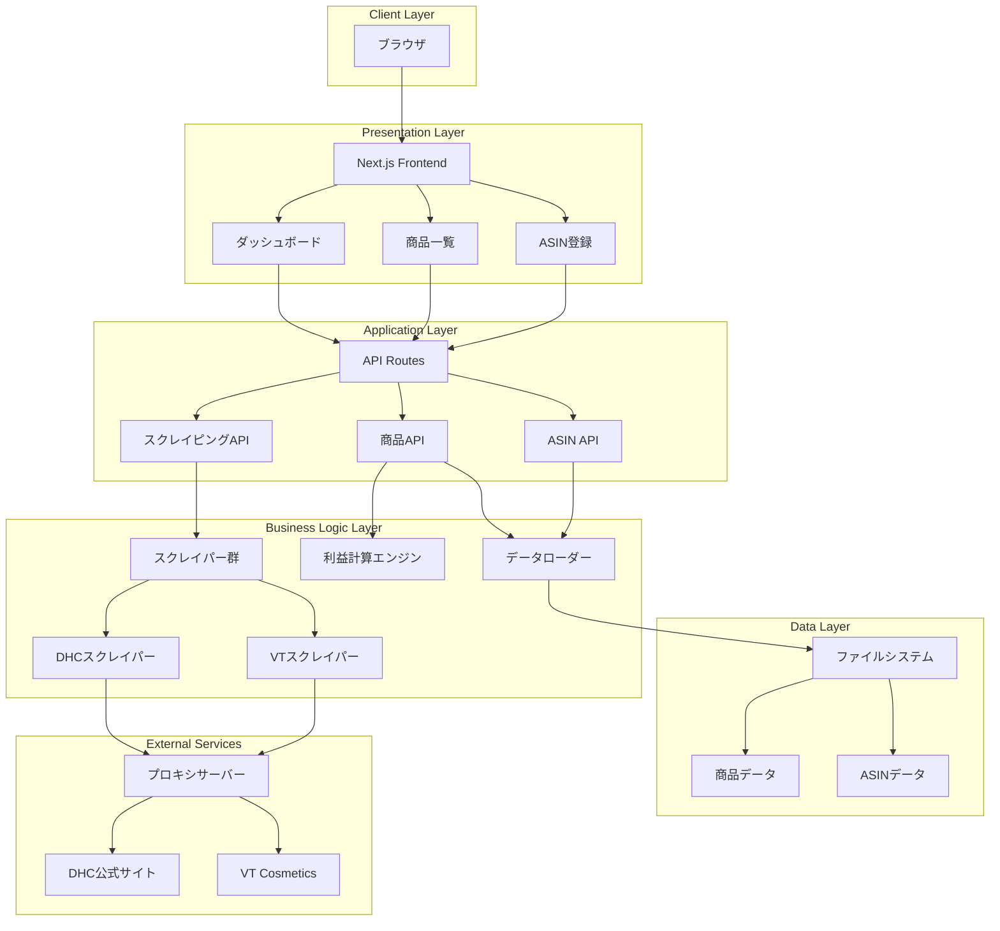
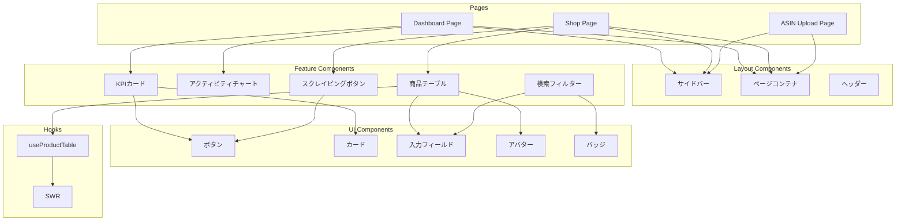
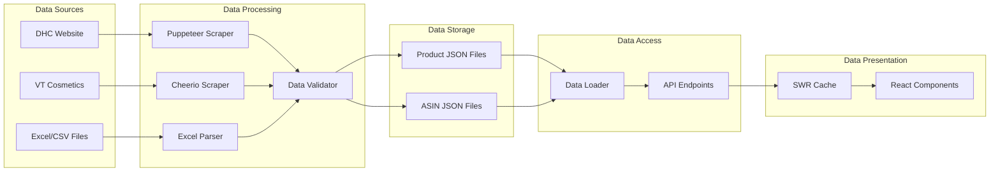
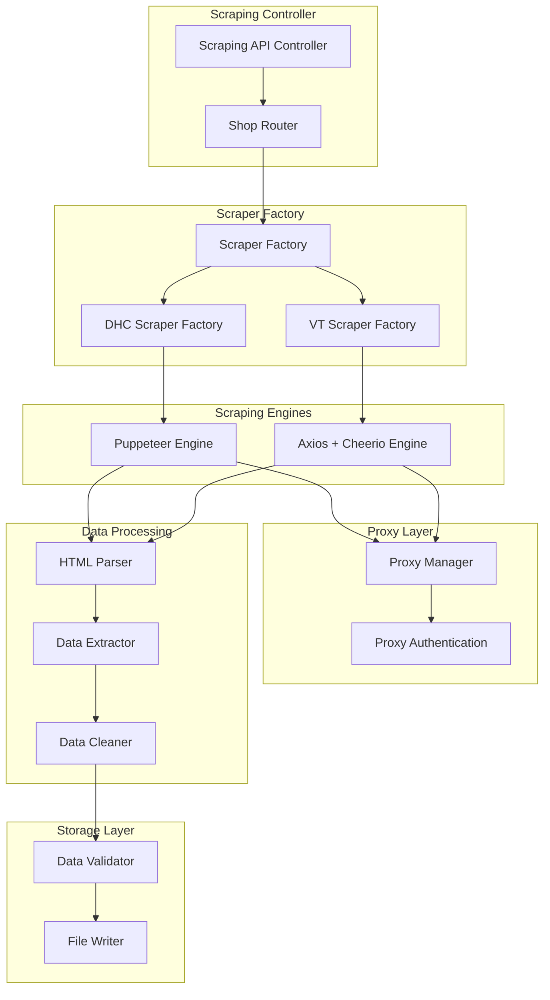
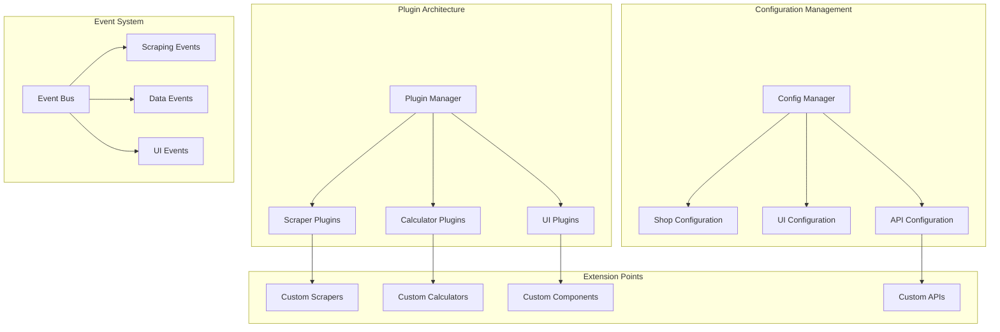

# アーキテクチャ図 - ShopScraper

## 1. システム全体アーキテクチャ

```mermaid
graph TB
    subgraph "Client Layer"
        Browser[ブラウザ]
    end
    
    subgraph "Presentation Layer"
        NextJS[Next.js Frontend]
        Dashboard[ダッシュボード]
        ProductList[商品一覧]
        ASINUpload[ASIN登録]
    end
    
    subgraph "Application Layer"
        APIRoutes[API Routes]
        ScrapingAPI[スクレイピングAPI]
        ProductAPI[商品API]
        ASINAPI[ASIN API]
    end
    
    subgraph "Business Logic Layer"
        Scrapers[スクレイパー群]
        DHCScraper[DHCスクレイパー]
        VTScraper[VTスクレイパー]
        Calculator[利益計算エンジン]
        DataLoader[データローダー]
    end
    
    subgraph "Data Layer"
        FileSystem[ファイルシステム]
        ProductData[商品データ]
        ASINData[ASINデータ]
    end
    
    subgraph "External Services"
        DHCSite[DHC公式サイト]
        VTSite[VT Cosmetics]
        ProxyServer[プロキシサーバー]
    end
    
    Browser --> NextJS
    NextJS --> Dashboard
    NextJS --> ProductList
    NextJS --> ASINUpload
    
    Dashboard --> APIRoutes
    ProductList --> APIRoutes
    ASINUpload --> APIRoutes
    
    APIRoutes --> ScrapingAPI
    APIRoutes --> ProductAPI
    APIRoutes --> ASINAPI
    
    ScrapingAPI --> Scrapers
    ProductAPI --> DataLoader
    ASINAPI --> DataLoader
    
    Scrapers --> DHCScraper
    Scrapers --> VTScraper
    ProductAPI --> Calculator
    
    DHCScraper --> ProxyServer
    VTScraper --> ProxyServer
    DataLoader --> FileSystem
    
    ProxyServer --> DHCSite
    ProxyServer --> VTSite
    
    FileSystem --> ProductData
    FileSystem --> ASINData
```

## 2. コンポーネントアーキテクチャ

```mermaid
graph TB
    subgraph "Pages"
        DashboardPage[Dashboard Page]
        ShopPage[Shop Page]
        ASINPage[ASIN Upload Page]
    end
    
    subgraph "Layout Components"
        Sidebar[サイドバー]
        PageContainer[ページコンテナ]
        Header[ヘッダー]
    end
    
    subgraph "Feature Components"
        KPICard[KPIカード]
        ActivityChart[アクティビティチャート]
        ProductTable[商品テーブル]
        ScrapingButton[スクレイピングボタン]
        SearchFilter[検索フィルター]
    end
    
    subgraph "UI Components"
        Button[ボタン]
        Card[カード]
        Input[入力フィールド]
        Avatar[アバター]
        Badge[バッジ]
    end
    
    subgraph "Hooks"
        useProductTable[useProductTable]
        useSWR[SWR]
    end
    
    DashboardPage --> Sidebar
    DashboardPage --> PageContainer
    DashboardPage --> KPICard
    DashboardPage --> ActivityChart
    
    ShopPage --> Sidebar
    ShopPage --> PageContainer
    ShopPage --> ProductTable
    ShopPage --> ScrapingButton
    
    ASINPage --> Sidebar
    ASINPage --> PageContainer
    
    ProductTable --> useProductTable
    ProductTable --> Avatar
    ProductTable --> Input
    
    useProductTable --> useSWR
    
    KPICard --> Card
    KPICard --> Button
    ScrapingButton --> Button
    SearchFilter --> Input
    SearchFilter --> Badge
```

## 3. データフローアーキテクチャ

```mermaid
graph LR
    subgraph "Data Sources"
        DHC[DHC Website]
        VT[VT Cosmetics]
        Excel[Excel/CSV Files]
    end
    
    subgraph "Data Processing"
        PuppeteerScraper[Puppeteer Scraper]
        CheerioScraper[Cheerio Scraper]
        ExcelParser[Excel Parser]
        DataValidator[Data Validator]
    end
    
    subgraph "Data Storage"
        ProductJSON[Product JSON Files]
        ASINJSON[ASIN JSON Files]
    end
    
    subgraph "Data Access"
        DataLoader[Data Loader]
        APIEndpoints[API Endpoints]
    end
    
    subgraph "Data Presentation"
        SWRCache[SWR Cache]
        ReactComponents[React Components]
    end
    
    DHC --> PuppeteerScraper
    VT --> CheerioScraper
    Excel --> ExcelParser
    
    PuppeteerScraper --> DataValidator
    CheerioScraper --> DataValidator
    ExcelParser --> DataValidator
    
    DataValidator --> ProductJSON
    DataValidator --> ASINJSON
    
    ProductJSON --> DataLoader
    ASINJSON --> DataLoader
    
    DataLoader --> APIEndpoints
    APIEndpoints --> SWRCache
    SWRCache --> ReactComponents
```

## 4. スクレイピングアーキテクチャ

```mermaid
graph TB
    subgraph "Scraping Controller"
        ScrapingAPI[Scraping API Controller]
        ShopRouter[Shop Router]
    end
    
    subgraph "Scraper Factory"
        ScraperFactory[Scraper Factory]
        DHCFactory[DHC Scraper Factory]
        VTFactory[VT Scraper Factory]
    end
    
    subgraph "Scraping Engines"
        PuppeteerEngine[Puppeteer Engine]
        AxiosEngine[Axios + Cheerio Engine]
    end
    
    subgraph "Proxy Layer"
        ProxyManager[Proxy Manager]
        ProxyAuth[Proxy Authentication]
    end
    
    subgraph "Data Processing"
        HTMLParser[HTML Parser]
        DataExtractor[Data Extractor]
        DataCleaner[Data Cleaner]
    end
    
    subgraph "Storage Layer"
        FileWriter[File Writer]
        DataValidator[Data Validator]
    end
    
    ScrapingAPI --> ShopRouter
    ShopRouter --> ScraperFactory
    
    ScraperFactory --> DHCFactory
    ScraperFactory --> VTFactory
    
    DHCFactory --> PuppeteerEngine
    VTFactory --> AxiosEngine
    
    PuppeteerEngine --> ProxyManager
    AxiosEngine --> ProxyManager
    
    ProxyManager --> ProxyAuth
    
    PuppeteerEngine --> HTMLParser
    AxiosEngine --> HTMLParser
    
    HTMLParser --> DataExtractor
    DataExtractor --> DataCleaner
    DataCleaner --> DataValidator
    DataValidator --> FileWriter
```

## 5. 認証・セキュリティアーキテクチャ

```mermaid
graph TB
    subgraph "Client Security"
        CSP[Content Security Policy]
        InputValidation[Input Validation]
        XSSProtection[XSS Protection]
    end
    
    subgraph "API Security"
        RateLimit[Rate Limiting]
        RequestValidation[Request Validation]
        ErrorHandling[Error Handling]
    end
    
    subgraph "Data Security"
        FilePermissions[File Permissions]
        DataSanitization[Data Sanitization]
        SecureStorage[Secure Storage]
    end
    
    subgraph "Network Security"
        ProxyAuth[Proxy Authentication]
        HTTPSOnly[HTTPS Only]
        SecureHeaders[Security Headers]
    end
    
    subgraph "Environment Security"
        EnvVars[Environment Variables]
        SecretManagement[Secret Management]
        ConfigSecurity[Config Security]
    end
    
    CSP --> InputValidation
    InputValidation --> XSSProtection
    
    RateLimit --> RequestValidation
    RequestValidation --> ErrorHandling
    
    FilePermissions --> DataSanitization
    DataSanitization --> SecureStorage
    
    ProxyAuth --> HTTPSOnly
    HTTPSOnly --> SecureHeaders
    
    EnvVars --> SecretManagement
    SecretManagement --> ConfigSecurity
```

## 6. パフォーマンスアーキテクチャ

```mermaid
graph TB
    subgraph "Frontend Performance"
        CodeSplitting[Code Splitting]
        LazyLoading[Lazy Loading]
        Memoization[React Memoization]
        VirtualScrolling[Virtual Scrolling]
    end
    
    subgraph "Caching Layer"
        SWRCache[SWR Cache]
        BrowserCache[Browser Cache]
        StaticGeneration[Static Generation]
    end
    
    subgraph "API Performance"
        ResponseCompression[Response Compression]
        RequestBatching[Request Batching]
        AsyncProcessing[Async Processing]
    end
    
    subgraph "Data Performance"
        FileOptimization[File Optimization]
        DataPagination[Data Pagination]
        IndexedAccess[Indexed Access]
    end
    
    subgraph "Scraping Performance"
        ConcurrentScraping[Concurrent Scraping]
        RequestThrottling[Request Throttling]
        MemoryManagement[Memory Management]
    end
    
    CodeSplitting --> LazyLoading
    LazyLoading --> Memoization
    Memoization --> VirtualScrolling
    
    SWRCache --> BrowserCache
    BrowserCache --> StaticGeneration
    
    ResponseCompression --> RequestBatching
    RequestBatching --> AsyncProcessing
    
    FileOptimization --> DataPagination
    DataPagination --> IndexedAccess
    
    ConcurrentScraping --> RequestThrottling
    RequestThrottling --> MemoryManagement
```

## 7. 拡張性アーキテクチャ

```mermaid
graph TB
    subgraph "Plugin Architecture"
        PluginManager[Plugin Manager]
        ScraperPlugins[Scraper Plugins]
        CalculatorPlugins[Calculator Plugins]
        UIPlugins[UI Plugins]
    end
    
    subgraph "Configuration Management"
        ConfigManager[Config Manager]
        ShopConfig[Shop Configuration]
        UIConfig[UI Configuration]
        APIConfig[API Configuration]
    end
    
    subgraph "Event System"
        EventBus[Event Bus]
        ScrapingEvents[Scraping Events]
        DataEvents[Data Events]
        UIEvents[UI Events]
    end
    
    subgraph "Extension Points"
        CustomScrapers[Custom Scrapers]
        CustomCalculators[Custom Calculators]
        CustomComponents[Custom Components]
        CustomAPIs[Custom APIs]
    end
    
    PluginManager --> ScraperPlugins
    PluginManager --> CalculatorPlugins
    PluginManager --> UIPlugins
    
    ConfigManager --> ShopConfig
    ConfigManager --> UIConfig
    ConfigManager --> APIConfig
    
    EventBus --> ScrapingEvents
    EventBus --> DataEvents
    EventBus --> UIEvents
    
    ScraperPlugins --> CustomScrapers
    CalculatorPlugins --> CustomCalculators
    UIPlugins --> CustomComponents
    APIConfig --> CustomAPIs
```