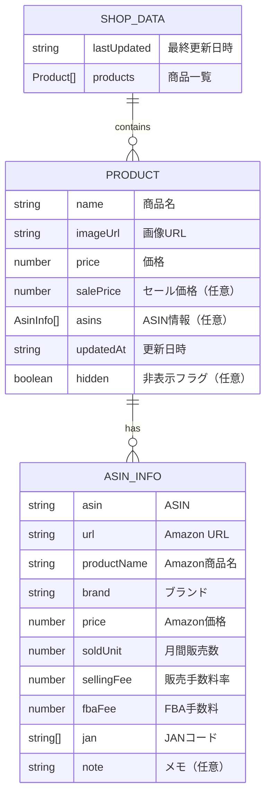

# データベース設計書 - ShopScraper

## 1. データ設計概要

### 1.1 データストレージ方式
- **方式**: ファイルベースJSON形式
- **理由**: 
  - WebContainer環境での制約
  - 軽量なデータ構造
  - バックアップとバージョン管理の容易さ
  - 外部データベース不要

### 1.2 ディレクトリ構造
```
src/data/
├── products/           # 商品データ
│   ├── official/      # 公式サイト
│   │   ├── dhc.json
│   │   └── vt-cosmetics.json
│   ├── rakuten/       # 楽天市場（将来拡張）
│   └── yahoo/         # Yahoo!ショッピング（将来拡張）
└── asin/              # ASINデータ
    ├── dhc.json
    └── vt-cosmetics.json
```

## 2. データモデル設計

### 2.1 商品データ（Product）



### 2.2 データ型定義

#### 2.2.1 ShopData型
```typescript
interface ShopData {
  lastUpdated: string;    // ISO 8601形式の日時文字列
  products: Product[];    // 商品配列
}
```

#### 2.2.2 Product型
```typescript
interface Product {
  name: string;           // 商品名（必須）
  imageUrl: string;       // 画像URL（空文字可）
  price: number;          // 価格（必須）
  salePrice?: number;     // セール価格（任意）
  asins?: AsinInfo[];     // ASIN情報配列（任意）
  updatedAt: string;      // 更新日時（ISO 8601）
  hidden?: boolean;       // 非表示フラグ（任意、デフォルト: false）
}
```

#### 2.2.3 AsinInfo型
```typescript
interface AsinInfo {
  asin: string;           // ASIN（10桁英数字）
  url: string;            // Amazon商品URL
  productName: string;    // Amazon商品名
  brand: string;          // ブランド名
  price: number;          // Amazon販売価格
  soldUnit: number;       // 月間販売個数
  sellingFee: number | null;  // 販売手数料率（%）
  fbaFee: number | null;      // FBA手数料（円）
  jan: string[];          // JANコード配列
  note?: string;          // メモ（任意）
}
```

## 3. ファイル設計

### 3.1 商品データファイル

#### 3.1.1 ファイル命名規則
- **パターン**: `{category}/{shopName}.json`
- **例**: 
  - `official/dhc.json`
  - `official/vt-cosmetics.json`
  - `rakuten/dhc.json`（将来）

#### 3.1.2 ファイル構造例
```json
{
  "lastUpdated": "2024-01-15T10:30:00.000Z",
  "products": [
    {
      "name": "VT CICA マイルド フォーム クレンザー 300ml",
      "imageUrl": "https://images.unsplash.com/photo-1556228578-8c89e6adf883?w=300&h=300&fit=crop",
      "price": 1980,
      "salePrice": 1584,
      "asins": [
        {
          "asin": "B08XYZ1234",
          "url": "https://amazon.co.jp/dp/B08XYZ1234",
          "productName": "VT CICA フォームクレンザー",
          "brand": "vt-cosmetics",
          "price": 2200,
          "soldUnit": 150,
          "sellingFee": 15,
          "fbaFee": 350,
          "jan": ["4901234567890"],
          "note": ""
        }
      ],
      "updatedAt": "2024-01-15T10:30:00.000Z",
      "hidden": false
    }
  ]
}
```

### 3.2 ASINデータファイル

#### 3.2.1 ファイル命名規則
- **パターン**: `asin/{brand}.json`
- **例**: 
  - `asin/dhc.json`
  - `asin/vt-cosmetics.json`

#### 3.2.2 ファイル構造例
```json
[
  {
    "asin": "B08XYZ1234",
    "url": "https://amazon.co.jp/dp/B08XYZ1234",
    "productName": "VT CICA フォームクレンザー 300ml",
    "brand": "vt-cosmetics",
    "price": 2200,
    "soldUnit": 150,
    "sellingFee": 15,
    "fbaFee": 350,
    "jan": ["4901234567890", "4901234567891"],
    "note": "人気商品"
  }
]
```

## 4. データアクセスパターン

### 4.1 読み取り操作

#### 4.1.1 商品データ読み取り
```typescript
// 特定ショップの商品データ取得
async function loadShopData(category: string, shopName: string): Promise<ShopData>

// 全商品データ取得
async function getAllProducts(): Promise<Product[]>

// 全ショップ一覧取得
async function getAllShops(): Promise<{ category: string; shops: string[] }[]>
```

#### 4.1.2 ASIN情報読み取り
```typescript
// 特定ASINの情報取得
async function getAsinInfo(asin: string, brand: string): Promise<AsinInfo>

// ブランド別ASIN一覧取得
async function getBrandAsins(brand: string): Promise<AsinInfo[]>
```

### 4.2 書き込み操作

#### 4.2.1 商品データ書き込み
```typescript
// ショップデータ保存
async function saveShopData(category: string, shopName: string, data: ShopData): Promise<void>

// 商品のASIN更新
async function updateProductAsin(category: string, shopName: string, index: number, asin: string): Promise<void>

// 商品の非表示状態更新
async function updateProductHidden(category: string, shopName: string, index: number, hidden: boolean): Promise<void>
```

#### 4.2.2 ASIN情報書き込み
```typescript
// ASIN情報一括保存
async function saveAsinData(brand: string, asinList: AsinInfo[]): Promise<void>
```

## 5. データ整合性

### 5.1 バリデーションルール

#### 5.1.1 Product型バリデーション
- `name`: 必須、空文字不可
- `imageUrl`: 文字列（空文字可）
- `price`: 必須、正の数値
- `salePrice`: 任意、正の数値、price未満
- `updatedAt`: 必須、ISO 8601形式
- `hidden`: 任意、boolean

#### 5.1.2 AsinInfo型バリデーション
- `asin`: 必須、10桁英数字
- `url`: 必須、有効なURL形式
- `productName`: 必須、空文字不可
- `brand`: 必須、空文字不可
- `price`: 必須、正の数値
- `soldUnit`: 必須、0以上の整数
- `sellingFee`: null または 0-100の数値
- `fbaFee`: null または正の数値
- `jan`: 配列、各要素は数字文字列

### 5.2 データ制約

#### 5.2.1 ファイルサイズ制約
- **最大ファイルサイズ**: 10MB
- **最大商品数**: 1ファイルあたり10,000件
- **最大ASIN数**: 1ファイルあたり50,000件

#### 5.2.2 文字列長制約
- `name`: 最大500文字
- `imageUrl`: 最大2000文字
- `productName`: 最大500文字
- `brand`: 最大100文字
- `note`: 最大1000文字

## 6. パフォーマンス設計

### 6.1 読み取りパフォーマンス

#### 6.1.1 キャッシュ戦略
- **SWRキャッシュ**: フロントエンドでのデータキャッシュ
- **ファイルキャッシュ**: Node.jsでのファイル読み取りキャッシュ
- **メモリキャッシュ**: 頻繁にアクセスされるデータのメモリ保持

#### 6.1.2 最適化手法
- **遅延読み込み**: 必要な時のみファイル読み取り
- **部分読み込み**: 大きなファイルの部分的読み取り
- **並列処理**: 複数ファイルの並列読み取り

### 6.2 書き込みパフォーマンス

#### 6.2.1 書き込み最適化
- **バッチ処理**: 複数更新の一括処理
- **差分更新**: 変更された部分のみ更新
- **非同期処理**: UIブロックを避ける非同期書き込み

#### 6.2.2 ファイルロック
- **排他制御**: 同時書き込みの防止
- **トランザクション**: 原子性の保証
- **バックアップ**: 書き込み前のバックアップ作成

## 7. バックアップ・復旧

### 7.1 バックアップ戦略

#### 7.1.1 自動バックアップ
```typescript
// 日次バックアップ（将来実装）
async function createDailyBackup(): Promise<void> {
  const timestamp = new Date().toISOString().split('T')[0];
  const backupDir = `backups/${timestamp}`;
  // データディレクトリ全体をコピー
}
```

#### 7.1.2 手動バックアップ
- **エクスポート機能**: JSON形式でのデータエクスポート
- **インポート機能**: バックアップファイルからの復元

### 7.2 データ移行

#### 7.2.1 スキーマ変更対応
```typescript
// データマイグレーション例
async function migrateDataV1ToV2(data: any): Promise<ShopData> {
  return {
    lastUpdated: data.lastUpdated || new Date().toISOString(),
    products: data.products.map((product: any) => ({
      ...product,
      hidden: product.hidden || false, // 新フィールド追加
    })),
  };
}
```

#### 7.2.2 バージョン管理
- **スキーマバージョン**: データ構造のバージョン管理
- **互換性チェック**: 古いデータ形式の検出と変換
- **段階的移行**: 大規模データの段階的移行

## 8. セキュリティ

### 8.1 データ保護

#### 8.1.1 ファイルアクセス制御
- **読み取り権限**: 適切なファイル権限設定
- **書き込み権限**: 必要最小限の書き込み権限
- **ディレクトリ保護**: データディレクトリの保護

#### 8.1.2 データ暗号化
- **機密データ**: プロキシ認証情報の暗号化
- **バックアップ**: バックアップファイルの暗号化（将来）

### 8.2 入力検証

#### 8.2.1 データ検証
- **型チェック**: TypeScriptによる型安全性
- **値検証**: 範囲チェック、形式チェック
- **サニタイゼーション**: 危険な文字の除去

#### 8.2.2 ファイル検証
- **ファイルサイズ**: 最大サイズチェック
- **ファイル形式**: JSON形式の検証
- **文字エンコーディング**: UTF-8エンコーディングの確認