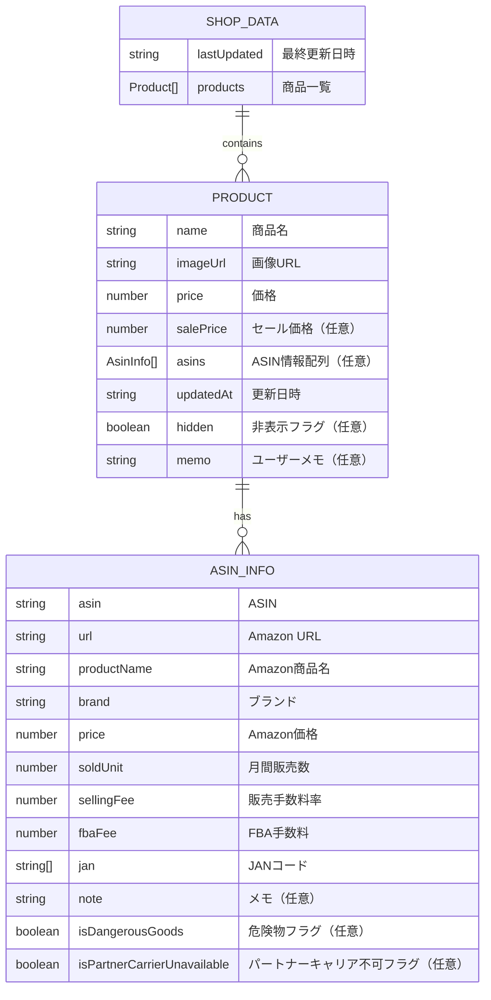

# データベース設計書 - ShopScraper

## 1. データ設計概要

### 1.1 データストレージ方式
- **方式**: ファイルベースJSON形式
- **理由**: 
  - WebContainer環境での制約
  - 軽量なデータ構造
  - バックアップとバージョン管理の容易さ
  - 外部データベース不要

### 1.2 ディレクトリ構造
```
src/data/
├── products/           # 商品データ
│   ├── official/      # 公式サイト
│   │   ├── dhc.json
│   │   └── vt-cosmetics.json
│   ├── rakuten/       # 楽天市場（将来拡張）
│   └── yahoo/         # Yahoo!ショッピング（将来拡張）
└── asin/              # ASINデータ
    ├── dhc.json
    └── vt-cosmetics.json
```

## 2. データモデル設計

### 2.1 商品データ（Product）



### 2.2 データ型定義

#### 2.2.1 ShopData型
```typescript
interface ShopData {
  lastUpdated: string;    // ISO 8601形式の日時文字列
  products: Product[];    // 商品配列
}
```

#### 2.2.2 Product型（更新版）
```typescript
interface Product {
  name: string;           // 商品名（必須）
  imageUrl: string;       // 画像URL（空文字可）
  price: number;          // 価格（必須）
  salePrice?: number;     // セール価格（任意）
  asins?: AsinInfo[];     // ASIN情報配列（任意）- 複数ASIN対応
  updatedAt: string;      // 更新日時（ISO 8601）
  hidden?: boolean;       // 非表示フラグ（任意、デフォルト: false）
  memo?: string;          // ユーザーメモ（任意）- 新規追加
}
```

#### 2.2.3 AsinInfo型（更新版）
```typescript
interface AsinInfo {
  asin: string;                           // ASIN（10桁英数字）
  url: string;                            // Amazon商品URL
  productName: string;                    // Amazon商品名
  brand: string;                          // ブランド名
  price: number;                          // Amazon販売価格
  soldUnit: number;                       // 月間販売個数
  sellingFee: number | null;              // 販売手数料率（%）
  fbaFee: number | null;                  // FBA手数料（円）
  jan: string[];                          // JANコード配列
  note?: string;                          // メモ（任意）
  isDangerousGoods?: boolean;             // 危険物フラグ（任意）
  isPartnerCarrierUnavailable?: boolean;  // パートナーキャリア不可フラグ（任意）- 新規追加
}
```

#### 2.2.4 フィルタリング設定型（新規追加）
```typescript
interface FilterSettings {
  search: string;                         // 検索文字列
  showHidden: boolean;                    // 非表示商品を表示
  showDangerousGoods: boolean;            // 危険物のみ表示
  showPartnerCarrierUnavailable: boolean; // パートナーキャリア不可のみ表示
  priceRange: {
    min: number | null;                   // 最小価格
    max: number | null;                   // 最大価格
  };
  hasAsin: boolean | null;                // ASIN有無（true: あり, false: なし, null: 全て）
}
```

## 3. ファイル設計

### 3.1 商品データファイル

#### 3.1.1 ファイル構造例（更新版）
```json
{
  "lastUpdated": "2024-01-15T10:30:00.000Z",
  "products": [
    {
      "name": "VT CICA マイルド フォーム クレンザー 300ml",
      "imageUrl": "https://images.unsplash.com/photo-1556228578-8c89e6adf883?w=300&h=300&fit=crop",
      "price": 1980,
      "salePrice": 1584,
      "asins": [
        {
          "asin": "B08XYZ1234",
          "url": "https://amazon.co.jp/dp/B08XYZ1234",
          "productName": "VT CICA フォームクレンザー",
          "brand": "vt-cosmetics",
          "price": 2200,
          "soldUnit": 150,
          "sellingFee": 15,
          "fbaFee": 350,
          "jan": ["4901234567890"],
          "note": "",
          "isDangerousGoods": false,
          "isPartnerCarrierUnavailable": false
        },
        {
          "asin": "B09ABC5678",
          "url": "https://amazon.co.jp/dp/B09ABC5678",
          "productName": "VT CICA フォームクレンザー 大容量",
          "brand": "vt-cosmetics",
          "price": 3200,
          "soldUnit": 80,
          "sellingFee": 15,
          "fbaFee": 450,
          "jan": ["4901234567891"],
          "note": "大容量版",
          "isDangerousGoods": true,
          "isPartnerCarrierUnavailable": false
        }
      ],
      "updatedAt": "2024-01-15T10:30:00.000Z",
      "hidden": false,
      "memo": "人気商品"
    }
  ]
}
```

### 3.2 ASINデータファイル（更新版）

#### 3.2.1 ファイル構造例
```json
[
  {
    "asin": "B08XYZ1234",
    "url": "https://amazon.co.jp/dp/B08XYZ1234",
    "productName": "VT CICA フォームクレンザー 300ml",
    "brand": "vt-cosmetics",
    "price": 2200,
    "soldUnit": 150,
    "sellingFee": 15,
    "fbaFee": 350,
    "jan": ["4901234567890", "4901234567891"],
    "note": "人気商品",
    "isDangerousGoods": false,
    "isPartnerCarrierUnavailable": false
  },
  {
    "asin": "B09ABC5678",
    "url": "https://amazon.co.jp/dp/B09ABC5678",
    "productName": "",
    "brand": "vt-cosmetics",
    "price": 0,
    "soldUnit": 0,
    "sellingFee": null,
    "fbaFee": null,
    "jan": [],
    "note": "手動入力が必要",
    "isDangerousGoods": true,
    "isPartnerCarrierUnavailable": true
  }
]
```

## 4. データアクセスパターン

### 4.1 読み取り操作

#### 4.1.1 商品データ読み取り
```typescript
// 特定ショップの商品データ取得
async function loadShopData(category: string, shopName: string): Promise<ShopData>

// 全商品データ取得
async function getAllProducts(): Promise<Product[]>

// 全ショップ一覧取得
async function getAllShops(): Promise<{ category: string; shops: string[] }[]>
```

#### 4.1.2 ASIN情報読み取り（エラーハンドリング強化）
```typescript
// 特定ASINの情報取得（404時は基本情報を生成）
async function fetchASINInfo(asin: string, brand: string): Promise<AsinInfo>

// ブランド別ASIN一覧取得
async function getBrandAsins(brand: string): Promise<AsinInfo[]>
```

### 4.2 書き込み操作

#### 4.2.1 商品データ書き込み（更新版）
```typescript
// ショップデータ保存
async function saveShopData(category: string, shopName: string, data: ShopData): Promise<void>

// 商品のASIN追加
async function addProductAsin(category: string, shopName: string, productIndex: number, asinInfo: AsinInfo): Promise<void>

// 商品のASIN削除
async function removeProductAsin(category: string, shopName: string, productIndex: number, asinIndex: number): Promise<void>

// 商品メモ更新
async function updateProductMemo(category: string, shopName: string, index: number, memo: string): Promise<void>

// 危険物フラグ更新
async function updateAsinDangerousGoods(category: string, shopName: string, productIndex: number, asinIndex: number, isDangerousGoods: boolean): Promise<void>

// パートナーキャリア不可フラグ更新
async function updateAsinPartnerCarrier(category: string, shopName: string, productIndex: number, asinIndex: number, isPartnerCarrierUnavailable: boolean): Promise<void>
```

#### 4.2.2 ASIN情報書き込み（更新版）
```typescript
// ASIN情報一括保存
async function saveAsinData(brand: string, asinList: AsinInfo[]): Promise<void>

// 危険物フラグ更新
async function updateAsinDangerousGoodsFlag(asin: string, brand: string, isDangerousGoods: boolean): Promise<void>

// パートナーキャリア不可フラグ更新
async function updateAsinPartnerCarrierFlag(asin: string, brand: string, isPartnerCarrierUnavailable: boolean): Promise<void>
```

## 5. データ整合性

### 5.1 バリデーションルール

#### 5.1.1 Product型バリデーション（更新版）
- `name`: 必須、空文字不可
- `imageUrl`: 文字列（空文字可）
- `price`: 必須、正の数値
- `salePrice`: 任意、正の数値、price未満
- `asins`: 任意、AsinInfo配列
- `updatedAt`: 必須、ISO 8601形式
- `hidden`: 任意、boolean
- `memo`: 任意、文字列（最大1000文字）

#### 5.1.2 AsinInfo型バリデーション（更新版）
- `asin`: 必須、10桁英数字
- `url`: 必須、有効なURL形式
- `productName`: 文字列（空文字可、手動入力時）
- `brand`: 必須、空文字不可
- `price`: 数値（0可、手動入力時）
- `soldUnit`: 0以上の整数
- `sellingFee`: null または 0-100の数値
- `fbaFee`: null または正の数値
- `jan`: 配列、各要素は数字文字列
- `isDangerousGoods`: 任意、boolean
- `isPartnerCarrierUnavailable`: 任意、boolean

### 5.2 データ制約（更新版）

#### 5.2.1 ファイルサイズ制約
- **最大ファイルサイズ**: 10MB
- **最大商品数**: 1ファイルあたり10,000件
- **最大ASIN数**: 1商品あたり50件、1ファイルあたり100,000件

#### 5.2.2 文字列長制約
- `name`: 最大500文字
- `imageUrl`: 最大2000文字
- `productName`: 最大500文字
- `brand`: 最大100文字
- `note`: 最大1000文字
- `memo`: 最大1000文字

## 6. パフォーマンス設計

### 6.1 読み取りパフォーマンス

#### 6.1.1 キャッシュ戦略（更新版）
- **SWRキャッシュ**: フロントエンドでのデータキャッシュ
- **ファイルキャッシュ**: Node.jsでのファイル読み取りキャッシュ
- **メモリキャッシュ**: 頻繁にアクセスされるデータのメモリ保持
- **フィルタリングキャッシュ**: useMemoによるフィルタリング結果キャッシュ

#### 6.1.2 最適化手法（更新版）
- **遅延読み込み**: 必要な時のみファイル読み取り
- **部分読み込み**: 大きなファイルの部分的読み取り
- **並列処理**: 複数ファイルの並列読み取り
- **仮想スクロール**: 大量データ表示時のメモリ最適化（将来実装）

### 6.2 フィルタリング・並び替えパフォーマンス

#### 6.2.1 フィルタリング最適化
```typescript
// useMemoによるフィルタリング結果キャッシュ
const filteredProducts = useMemo(() => {
  // フィルタリング処理
}, [allProducts, filters]);

// 並び替え結果キャッシュ
const sortedProducts = useMemo(() => {
  // 並び替え処理
}, [filteredProducts, sortField, sortDirection]);
```

#### 6.2.2 検索最適化
- **インデックス作成**: 商品名・メモのインデックス（将来実装）
- **全文検索**: 高速な文字列検索（将来実装）
- **デバウンス**: 検索入力の遅延処理（将来実装）

## 7. エラーハンドリング・データ復旧

### 7.1 ASIN情報取得エラー対応

#### 7.1.1 404エラー時の自動フォールバック
```typescript
// 基本ASIN情報の自動生成
const fallbackAsinInfo: AsinInfo = {
  asin,
  url: `https://amazon.co.jp/dp/${asin}`,
  productName: "",
  brand,
  price: 0,
  soldUnit: 0,
  sellingFee: null,
  fbaFee: null,
  jan: [],
  note: "手動入力が必要",
  isDangerousGoods: false,
  isPartnerCarrierUnavailable: false,
};
```

#### 7.1.2 手動入力必要項目の検出
```typescript
const needsManualInput = !asinInfo.productName || 
                        asinInfo.price === 0 || 
                        asinInfo.sellingFee === null || 
                        asinInfo.fbaFee === null;
```

### 7.2 データ整合性チェック

#### 7.2.1 商品・ASIN整合性
- **重複ASIN検出**: 同一商品内での重複ASIN
- **無効ASIN検出**: 形式不正なASIN
- **孤立ASIN検出**: 商品に紐づかないASIN

#### 7.2.2 自動修復機能（将来実装）
- **重複ASIN統合**: 重複ASINの自動統合
- **無効データ除去**: 形式不正データの自動除去
- **整合性修復**: データ不整合の自動修復

## 8. セキュリティ・アクセス制御

### 8.1 データ保護（更新版）

#### 8.1.1 ファイルアクセス制御
- **読み取り権限**: 適切なファイル権限設定
- **書き込み権限**: 必要最小限の書き込み権限
- **ディレクトリ保護**: データディレクトリの保護
- **一時ファイル管理**: 処理中の一時ファイル適切な削除

#### 8.1.2 入力検証強化
- **ASIN形式検証**: 10桁英数字の厳密チェック
- **価格範囲検証**: 負の値・異常値の検出
- **文字列長検証**: 最大長制限の強制
- **SQLインジェクション対策**: 該当なし（ファイルベース）

### 8.2 データ暗号化（将来実装）

#### 8.2.1 機密データ暗号化
- **プロキシ認証情報**: 環境変数での暗号化保存
- **ユーザー設定**: ローカルストレージでの暗号化
- **バックアップファイル**: 暗号化バックアップ

## 9. 監視・ログ強化

### 9.1 詳細ログ出力

#### 9.1.1 ASIN関連ログ
```typescript
console.log(`Fetching ASIN info for: ${asin}, brand: ${brand}`);
console.log(`ASIN info retrieved:`, asinInfo);
console.log(`ASIN ${asin} successfully added to product ${productIndex}`);
console.error("Failed to add ASIN:", error);
```

#### 9.1.2 パフォーマンスログ
```typescript
console.time('filterProducts');
// フィルタリング処理
console.timeEnd('filterProducts');

console.time('sortProducts');
// 並び替え処理
console.timeEnd('sortProducts');
```

### 9.2 データ品質監視

#### 9.2.1 監視項目
- **手動入力必要ASIN数**: 未完了データの監視
- **重複ASIN数**: データ重複の監視
- **エラー発生率**: ASIN取得エラー率
- **ファイルサイズ推移**: データ増加率の監視

#### 9.2.2 アラート機能（将来実装）
- **データ品質低下**: 手動入力必要データの増加
- **パフォーマンス低下**: 処理時間の異常増加
- **エラー率上昇**: API エラー率の異常値