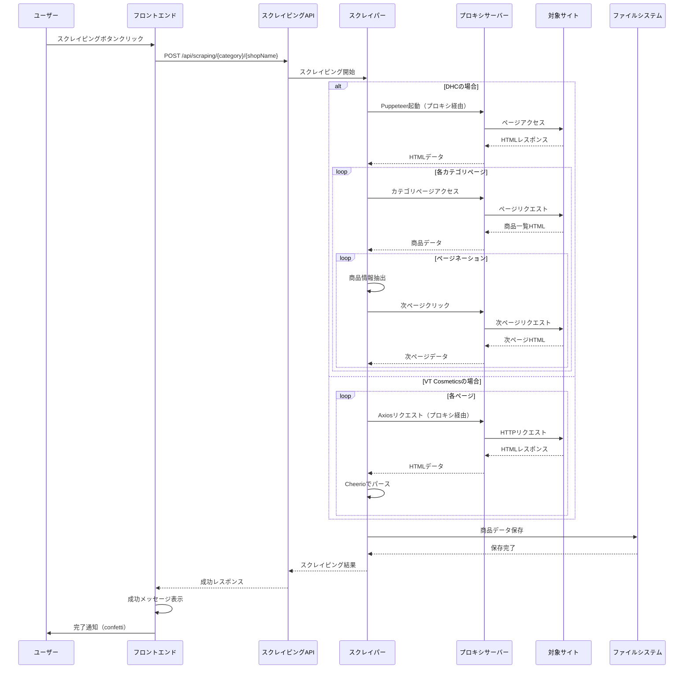
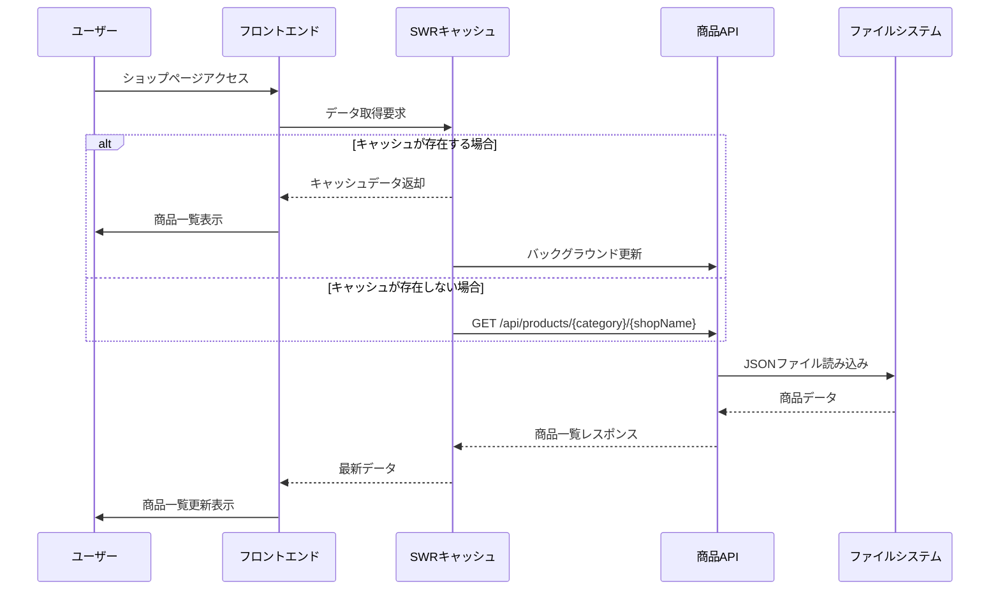
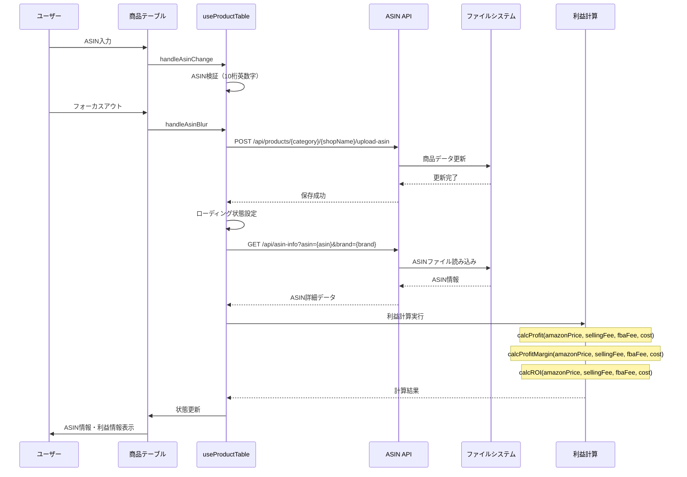
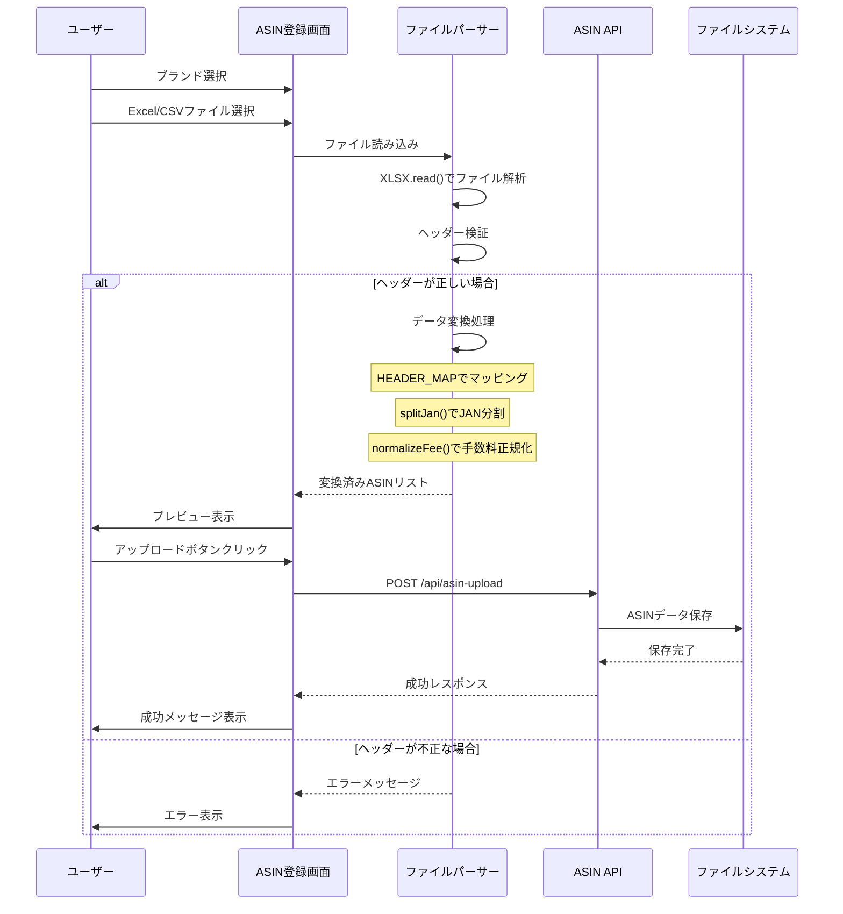
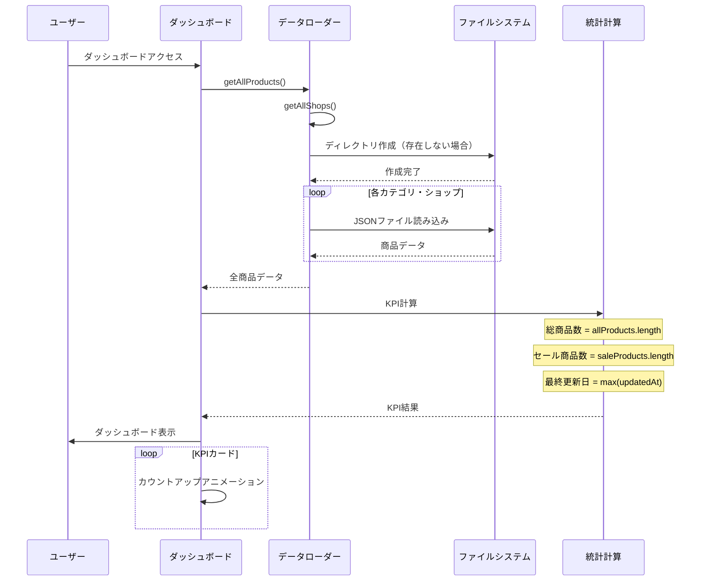
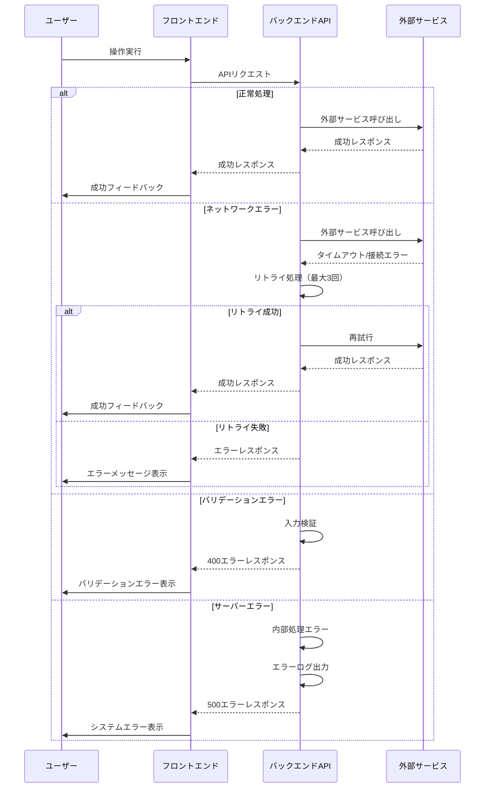
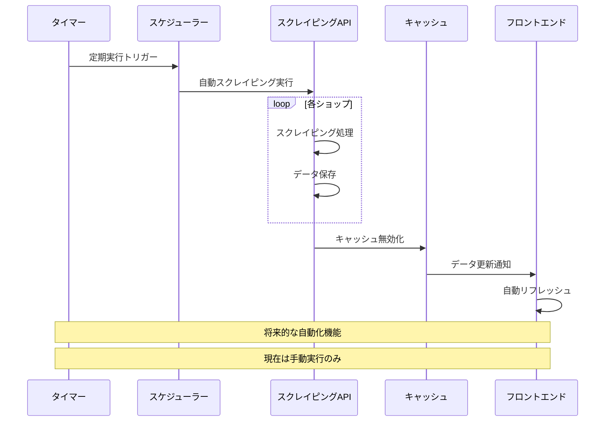

# シーケンス図 - ShopScraper

## 1. スクレイピング処理シーケンス

```mermaid
sequenceDiagram
    participant User as ユーザー
    participant UI as フロントエンド
    participant API as スクレイピングAPI
    participant Scraper as スクレイパー
    participant Proxy as プロキシサーバー
    participant Site as 対象サイト
    participant FS as ファイルシステム

    User->>UI: スクレイピングボタンクリック
    UI->>API: POST /api/scraping/{category}/{shopName}
    API->>Scraper: スクレイピング開始
    
    alt DHCの場合
        Scraper->>Proxy: Puppeteer起動（プロキシ経由）
        Proxy->>Site: ページアクセス
        Site-->>Proxy: HTMLレスポンス
        Proxy-->>Scraper: HTMLデータ
        
        loop 各カテゴリページ
            Scraper->>Proxy: カテゴリページアクセス
            Proxy->>Site: ページリクエスト
            Site-->>Proxy: 商品一覧HTML
            Proxy-->>Scraper: 商品データ
            
            loop ページネーション
                Scraper->>Scraper: 商品情報抽出
                Scraper->>Proxy: 次ページクリック
                Proxy->>Site: 次ページリクエスト
                Site-->>Proxy: 次ページHTML
                Proxy-->>Scraper: 次ページデータ
            end
        end
        
    else VT Cosmeticsの場合
        loop 各ページ
            Scraper->>Proxy: Axiosリクエスト（プロキシ経由）
            Proxy->>Site: HTTPリクエスト
            Site-->>Proxy: HTMLレスポンス
            Proxy-->>Scraper: HTMLデータ
            Scraper->>Scraper: Cheerioでパース
        end
    end
    
    Scraper->>FS: 商品データ保存
    FS-->>Scraper: 保存完了
    Scraper-->>API: スクレイピング結果
    API-->>UI: 成功レスポンス
    UI->>UI: 成功メッセージ表示
    UI->>User: 完了通知（confetti）
```

## 2. 商品一覧表示シーケンス

```mermaid
sequenceDiagram
    participant User as ユーザー
    participant UI as フロントエンド
    participant SWR as SWRキャッシュ
    participant API as 商品API
    participant FS as ファイルシステム

    User->>UI: ショップページアクセス
    UI->>SWR: データ取得要求
    
    alt キャッシュが存在する場合
        SWR-->>UI: キャッシュデータ返却
        UI->>User: 商品一覧表示
        SWR->>API: バックグラウンド更新
    else キャッシュが存在しない場合
        SWR->>API: GET /api/products/{category}/{shopName}
    end
    
    API->>FS: JSONファイル読み込み
    FS-->>API: 商品データ
    API-->>SWR: 商品一覧レスポンス
    SWR-->>UI: 最新データ
    UI->>User: 商品一覧更新表示
```

## 3. ASIN情報取得・利益計算シーケンス

```mermaid
sequenceDiagram
    participant User as ユーザー
    participant UI as 商品テーブル
    participant Hook as useProductTable
    participant API as ASIN API
    participant FS as ファイルシステム
    participant Calc as 利益計算

    User->>UI: ASIN入力
    UI->>Hook: handleAsinChange
    Hook->>Hook: ASIN検証（10桁英数字）
    User->>UI: フォーカスアウト
    UI->>Hook: handleAsinBlur
    
    Hook->>API: POST /api/products/{category}/{shopName}/upload-asin
    API->>FS: 商品データ更新
    FS-->>API: 更新完了
    API-->>Hook: 保存成功
    
    Hook->>Hook: ローディング状態設定
    Hook->>API: GET /api/asin-info?asin={asin}&brand={brand}
    API->>FS: ASINファイル読み込み
    FS-->>API: ASIN情報
    API-->>Hook: ASIN詳細データ
    
    Hook->>Calc: 利益計算実行
    Note over Calc: calcProfit(amazonPrice, sellingFee, fbaFee, cost)
    Note over Calc: calcProfitMargin(amazonPrice, sellingFee, fbaFee, cost)
    Note over Calc: calcROI(amazonPrice, sellingFee, fbaFee, cost)
    Calc-->>Hook: 計算結果
    
    Hook->>UI: 状態更新
    UI->>User: ASIN情報・利益情報表示
```

## 4. ASIN一括登録シーケンス

```mermaid
sequenceDiagram
    participant User as ユーザー
    participant UI as ASIN登録画面
    participant Parser as ファイルパーサー
    participant API as ASIN API
    participant FS as ファイルシステム

    User->>UI: ブランド選択
    User->>UI: Excel/CSVファイル選択
    UI->>Parser: ファイル読み込み
    
    Parser->>Parser: XLSX.read()でファイル解析
    Parser->>Parser: ヘッダー検証
    
    alt ヘッダーが正しい場合
        Parser->>Parser: データ変換処理
        Note over Parser: HEADER_MAPでマッピング
        Note over Parser: splitJan()でJAN分割
        Note over Parser: normalizeFee()で手数料正規化
        Parser-->>UI: 変換済みASINリスト
        UI->>User: プレビュー表示
        
        User->>UI: アップロードボタンクリック
        UI->>API: POST /api/asin-upload
        API->>FS: ASINデータ保存
        FS-->>API: 保存完了
        API-->>UI: 成功レスポンス
        UI->>User: 成功メッセージ表示
        
    else ヘッダーが不正な場合
        Parser-->>UI: エラーメッセージ
        UI->>User: エラー表示
    end
```

## 5. ダッシュボード表示シーケンス

```mermaid
sequenceDiagram
    participant User as ユーザー
    participant UI as ダッシュボード
    participant Loader as データローダー
    participant FS as ファイルシステム
    participant Calc as 統計計算

    User->>UI: ダッシュボードアクセス
    UI->>Loader: getAllProducts()
    
    Loader->>Loader: getAllShops()
    Loader->>FS: ディレクトリ作成（存在しない場合）
    FS-->>Loader: 作成完了
    
    loop 各カテゴリ・ショップ
        Loader->>FS: JSONファイル読み込み
        FS-->>Loader: 商品データ
    end
    
    Loader-->>UI: 全商品データ
    
    UI->>Calc: KPI計算
    Note over Calc: 総商品数 = allProducts.length
    Note over Calc: セール商品数 = saleProducts.length
    Note over Calc: 最終更新日 = max(updatedAt)
    Calc-->>UI: KPI結果
    
    UI->>User: ダッシュボード表示
    
    loop KPIカード
        UI->>UI: カウントアップアニメーション
    end
```

## 6. エラーハンドリングシーケンス

```mermaid
sequenceDiagram
    participant User as ユーザー
    participant UI as フロントエンド
    participant API as バックエンドAPI
    participant External as 外部サービス

    User->>UI: 操作実行
    UI->>API: APIリクエスト
    
    alt 正常処理
        API->>External: 外部サービス呼び出し
        External-->>API: 成功レスポンス
        API-->>UI: 成功レスポンス
        UI->>User: 成功フィードバック
        
    else ネットワークエラー
        API->>External: 外部サービス呼び出し
        External-->>API: タイムアウト/接続エラー
        API->>API: リトライ処理（最大3回）
        
        alt リトライ成功
            API->>External: 再試行
            External-->>API: 成功レスポンス
            API-->>UI: 成功レスポンス
            UI->>User: 成功フィードバック
        else リトライ失敗
            API-->>UI: エラーレスポンス
            UI->>User: エラーメッセージ表示
        end
        
    else バリデーションエラー
        API->>API: 入力検証
        API-->>UI: 400エラーレスポンス
        UI->>User: バリデーションエラー表示
        
    else サーバーエラー
        API->>API: 内部処理エラー
        API->>API: エラーログ出力
        API-->>UI: 500エラーレスポンス
        UI->>User: システムエラー表示
    end
```

## 7. データ同期シーケンス

```mermaid
sequenceDiagram
    participant Timer as タイマー
    participant Scheduler as スケジューラー
    participant API as スクレイピングAPI
    participant Cache as キャッシュ
    participant UI as フロントエンド

    Timer->>Scheduler: 定期実行トリガー
    Scheduler->>API: 自動スクレイピング実行
    
    loop 各ショップ
        API->>API: スクレイピング処理
        API->>API: データ保存
    end
    
    API->>Cache: キャッシュ無効化
    Cache->>UI: データ更新通知
    UI->>UI: 自動リフレッシュ
    
    Note over Timer, UI: 将来的な自動化機能
    Note over Timer, UI: 現在は手動実行のみ
```